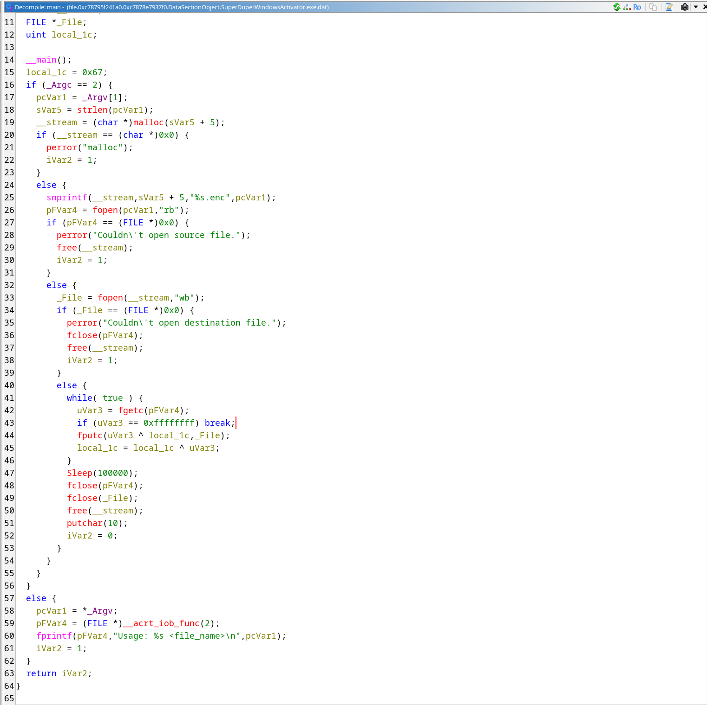

# Активация

В школе "Хогвартс" установили компьютер на базе ОС Windows.

Как известно, для того чтобы использовать все функции ОС Windows, нужно
её активировать, введя лицензионный ключ или использовав другой метод активации.

Поскольку в пределах школы не работает большинство маггловских устройств, активировать ОС с помощью ключа активации не получилось. Чтобы активировать ОС настраивающий компьютер волшебник решил скачать активатор из интернета, но что-то пошло не так и при активации ОС все файлы с важными данными на компьютере были зашифрованы!

Помогите волшебнику восстановить важные данные.

- Рекомендуемые утилиты: volatility3, Ghidra, Python.
- Цель работы: исследование дампа памяти операционной системы.
- Итог работы: получение доступа к флагу.
- Критерий оценки: предоставление правильного флага.

## Решение

Нам дан сжатый с помощью xz дамп - разархивируем его, после чего пройдёмся по нему с помощью volatility.

Из названия дампа предположим, что это дамп Windows. Посмотрим на него с помощью `windows.info`:

```sh
justmarfix@justpc: ~/infosec/forensics_11
$ vol -f windows.dmp windows.info
Volatility 3 Framework 2.26.2
Progress:  100.00		PDB scanning finished
Variable	Value2026-01-15_02-19

Kernel Base	0xf80440600000
DTB	0x1aa000
Symbols	file:///usr/lib/python3.14/site-packages/volatility3/symbols/windows/ntkrnlmp.pdb/CA8E2F01B822EDE6357898BFBF862997-1.json.xz
Is64Bit	True
IsPAE	False
layer_name	0 WindowsIntel32e
memory_layer	1 WindowsCrashDump64Layer
base_layer	2 FileLayer
KdVersionBlock	0xf8044120f368
Major/Minor	15.19041
MachineType	34404
KeNumberProcessors	4
SystemTime	2026-01-01 20:28:06+00:00
NtSystemRoot	C:\Windows
NtProductType	NtProductWinNt
NtMajorVersion	10
NtMinorVersion	0
PE MajorOperatingSystemVersion	10
PE MinorOperatingSystemVersion	0
PE Machine	34404
PE TimeDateStamp	Wed Jan  4 04:27:11 1995
```

Да, действительно, это дамп оперативной памяти Windows. Посмотрим, какие файлы были загружены в память с помощью `windows.filescan` и поищем в них, для начала, содержимое директорий пользователей.

Выполним:

```sh
vol -f windows.dmp windows.filescan > filescan.txt && grep '\\Users' filescan.txt
```

Посмотрим на результат. Увидим существующего пользователя `infosec.windows`. Посмотрим на его файлы - в директории `\Users\infosec.windows\Downloads` лежит подозрительный файл `SuperDuperWindowsActivator.exe`, а рядом с ним - `flag.txt.enc`.

```
0xc78795b7c600	\Users\infosec.windows\Downloads\flag.txt.enc
0xc78795f241a0	\Users\infosec.windows\Downloads\SuperDuperWindowsActivator.exe
```

Вытащим оба этих файла командами:

```sh
vol -f windows.dmp windows.dumpfile --virtaddr 0xc78795b7c600
vol -f windows.dmp windows.dumpfile --virtaddr 0xc78795f241a0
```

Посмотрим, что делал исполняемый файл - запустим Ghidra и проанализируем его в ней. В декомпиляции функции `main` увидим следующее:



Код достаточно простой - функционал шифрования начинается с строки 41. Программа вычитывает данные из файла до EOF, после чего шифрует и записывает в файл с расширением `.enc` содержимое изначального файла. Алгоритм шифрования работает следующим образом:

```c
fputc(byte ^ xor_key, file);
xor_key ^= byte;
```

Изначальный ключ (строка 15 декомпиляции) равен `0x67`. Таким образом, легко придумать алгоритм дешифрования - его код приводится ниже.

```py
def decrypt_xor(ciphertext_hex):
    ciphertext = bytes.fromhex(ciphertext_hex)
    plaintext = []
    current_key = 0x67
    for cipher_byte in ciphertext:
        plain_byte = cipher_byte ^ current_key
        plaintext.append(plain_byte)
        current_key = current_key ^ plain_byte
    return bytes(plaintext)
```

Дешифруем и получаем флаг.
